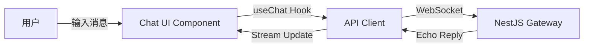

# 第一阶段行动计划：AI 聊天框与前后端互联

## 1. 目标 (Objectives)

构建一个基于 WebSocket 的实时 AI 对话系统，实现前端 React 组件与后端 NestJS 网关的端到端通信。

- **前端**：独立的 Feature Library (`libs/features/ai-chat`)，包含可复用的 Chat UI。
- **后端**：`api-gateway` 提供 WebSocket 服务端点，处理连接与消息转发。
- **验证**：实现“回声测试” (Echo Test)，确保消息链路通畅。

## 2. 架构设计 (Architecture)



## 3. 详细任务清单 (Task List)

### 3.1 前端开发 (libs/features/ai-chat)

- [x] **初始化库**：使用 Nx 生成 React Library。
  - 命令：`nx g @nx/react:lib features/ai-chat --directory=libs/features/ai-chat`
- [x] **安装依赖**：
  - `ai` (Vercel AI SDK)
  - `lucide-react` (图标)
  - `react-markdown` (Markdown 渲染)
- [x] **组件开发**：
  - `ChatWindow`: 主容器，负责布局。
  - `MessageList`: 消息列表，支持流式渲染。
  - `ChatInput`: 输入框，支持发送和 loading 状态。
- [x] **集成演示**：在 `apps/web/map-ai` 中引入并展示该组件。

### 3.2 后端开发 (apps/server/map-ai-api)

- [ ] **WebSocket 网关配置**：
  - 创建 `ChatGateway` (NestJS WebSocketGateway)。
  - 配置 CORS 和端口。
- [ ] **消息处理逻辑**：
  - 实现 `handleMessage` 事件订阅。
  - 实现简单的 Echo 逻辑：接收什么就返回什么（模拟 AI 回复）。

### 3.3 联调与验证

- [ ] **WebSocket 连接测试**：前端能成功连上后端 WS 服务。
- [ ] **全链路测试**：
  1. 用户在输入框输入 "Hello MapAI"。
  2. 聊天框立即显示用户消息。
  3. 后端接收到消息，延迟 1s 后返回 "AI: Hello MapAI"。
  4. 前端聊天框显示 AI 回复。

## 4. 目录结构预览

```text
libs/features/ai-chat/
├── src/
│   ├── lib/
│   │   ├── components/
│   │   │   ├── chat-window.tsx
│   │   │   ├── chat-input.tsx
│   │   │   └── message-list.tsx
│   │   ├── hooks/
│   │   │   └── use-socket-chat.ts  <-- 自定义 Hook 封装 WebSocket
│   │   └── ai-chat.tsx             <-- 导出入口
│   └── index.ts
```

## 5. 执行策略

1. 先创建前端库和 UI 组件（Mock 数据）。
2. 再写后端 WebSocket 服务。
3. 最后对接真实数据流。

## 6. 常见问题与解决方案 (Troubleshooting)

### 6.1 Vercel AI SDK 依赖与导入问题

**现象**：
在 Vite 项目中使用 `import { useChat } from 'ai/react'` 会报错，提示找不到模块或缺少导出。同时构建时可能提示缺少 `remark-gfm`。

**原因**：

1.  **SDK 版本变更**：`ai` 包升级到 v6 后，React Hooks 被拆分到了 `@ai-sdk/react` 包中。旧的 `ai/react` 路径在某些环境下不再支持或已被弃用。
2.  **依赖缺失**：`react-markdown` 常常需要配合 `remark-gfm` 插件使用，但它不是 `ai` SDK 的直接依赖。

**解决方案**：

1.  安装 `@ai-sdk/react`：
    ```bash
    pnpm add @ai-sdk/react
    ```
2.  修改导入路径：
    ```typescript
    // 错误
    import { useChat } from 'ai/react';
    // 正确
    import { useChat } from '@ai-sdk/react';
    ```
3.  补充安装 `remark-gfm`：
    ```bash
    pnpm add remark-gfm
    ```

## 7. 前端知识点回顾与教学

### 7.1 React 纯度与幂等（关键）

- 组成规则
  - 组件与 Hooks 必须“纯且幂等”：同样的 props、state、context 输入，多次渲染应产生相同输出
  - 渲染阶段不得产生副作用；副作用应在事件处理或 Effect 中执行
- 易犯错误
  - 在渲染中调用非幂等函数：如 `Date.now()`、`new Date()`、`Math.random()`，导致输出不稳定
  - 在 Effect 中同步外部 props 到内部 state，易触发级联渲染与警告
- 正确做法
  - 渲染中只做“纯计算”；把时间戳、随机数的获取放入事件或 Effect
  - 受控/非受控模式明确：传入受控值时，不在 Effect 中“复制 props 到 state”
- 示例
  - 错误：
    ```tsx
    function BadClock() {
      const now = Date.now(); // ❌ 渲染中非幂等
      return <span>{now}</span>;
    }
    ```
  - 正确：
    ```tsx
    function GoodClock() {
      const [now, setNow] = useState<number>(() => Date.now()); // ✅ 初始值函数只运行一次
      useEffect(() => {
        const id = setInterval(() => setNow(Date.now()), 1000); // ✅ 副作用中更新
        return () => clearInterval(id);
      }, []);
      return <span>{now}</span>;
    }
    ```

### 7.2 Effects 最佳实践

- 目的：同步 React 与外部系统（DOM、网络、订阅、定时器）
- 准则
  - Effect 函数里做两件事：更新外部系统、订阅外部更新（在回调中 setState）
  - 清理函数对称释放资源（事件、定时器、订阅）
  - 依赖数组保持最小且正确，避免不必要重跑或遗漏
- 反例修复
  - 不在 Effect 中“把 props 写回 state”；改为使用派生值或受控模式判断

### 7.3 受控与非受控组件

- 受控：外部通过 props 完全掌控组件状态（如 `collapsed`）
- 非受控：组件内部管理状态（如 `internalCollapsed`）
- 组合策略：当传入受控值时仅用派生值渲染；未传入时内部管理并响应交互与窗口变化

### 7.4 状态建模与派生

- 原始状态与派生状态区分：派生值用 `useMemo` 或即时计算，不复制到 state
- 避免重复来源：同一数据只存一处，其他地方用计算得出
- 不可变更新：数组/对象用复制生成新引用，避免直接变异

### 7.5 渲染与副作用分层

- 渲染阶段：纯计算 UI
- 提交阶段：DOM 更新
- 副作用阶段：Effect/事件发生，允许访问 DOM、网络、定时器

### 7.6 UI/样式与主题

- Tailwind 原子类组织布局与间距；颜色通过 CSS 变量（如 `--ai-primary`、`--ai-border`）实现主题
- 局部主题：在组件根包裹主题容器（如 `AiTheme`）注入变量，避免全局耦合
- 本地化 UI 原子件（shadcn 风格）放在库内，保持独立可替换

### 7.7 网络与适配层

- 适配层（Adapters）：将网络调用抽象为方法，由宿主实现并注入组件
- 优点：组件不绑定具体 fetch/axios，不依赖后端实现细节，便于联调与测试
- 流式与批量：消息可支持流式 onDelta 与一次性完成两种模式

### 7.8 性能与可用性

- 列表性能：消息多时考虑虚拟化（react-virtualized/react-window）
- 滚动管理：自动滚动到底部仅在新增消息时触发，避免用户阅读中跳动
- 交互反馈：loading/禁用态、错误提示要清晰
- 响应式：窄屏折叠侧栏、拖动分隔线限制最小/最大宽度

### 7.9 测试与调试

- 单测：类型校验与基本渲染（React Testing Library）
- 集成：适配层的模拟（mock fetch/WS），验证消息发送与接收
- 可观察性：在 Effect 中加最小必要日志，避免泄露敏感信息

### 7.10 Nx 单仓库实践提示

- 库边界清晰：公共组件与类型从 `libs/features/...` 导出，避免 apps 直接跨层访问内部实现
- 依赖放置：UI 原子件与样式资源放在库内，避免全局根目录污染
- 可替换性：对外暴露最少 API，允许宿主覆写插槽与样式类

### 7.11 WebSocket Hook 实战：use-socket-chat

- 目标
  - 以 Hook 形式封装 WS 连接管理、重连、心跳、消息发送队列与流式合并
  - 与组件解耦，只暴露最少 API
- API 设计
  - `useSocketChat(options)` 返回 `{ status, connect, disconnect, send, messages }`
  - `options` 包含 `url`、心跳与重连设置、`onMessage` 回调
- 连接管理
  - 首次连接与重连采用指数退避
  - 打开后清空发送队列
  - 关闭或错误时进入重连流程
- 心跳策略
  - 定期发送 `ping`
  - 未收到 `pong` 达到阈值触发重连
- 发送队列
  - 未连接时将消息入队
  - 连接成功后批量发送
- 流式合并
  - 当服务端按 `id` 分批发送 `delta`，在客户端聚合到 `final` 再入消息列表

```tsx
import { useEffect, useMemo, useRef, useState } from 'react';

type SocketChatOptions = {
  url: string;
  reconnect?: boolean;
  maxRetries?: number;
  backoffBaseMs?: number;
  heartbeatMs?: number;
  onMessage?: (data: any) => void;
};

type SocketStatus = 'idle' | 'connecting' | 'open' | 'closing' | 'closed';

export function useSocketChat(options: SocketChatOptions) {
  const { url, reconnect = true, maxRetries = 5, backoffBaseMs = 500, heartbeatMs = 15000, onMessage } = options;
  const wsRef = useRef<WebSocket | null>(null);
  const statusRef = useRef<SocketStatus>('idle');
  const [status, setStatus] = useState<SocketStatus>('idle');
  const queueRef = useRef<string[]>([]);
  const retryRef = useRef(0);
  const heartbeatTimerRef = useRef<number | null>(null);
  const missPongRef = useRef(0);
  const [messages, setMessages] = useState<any[]>([]);
  const streamRef = useRef<Map<string, string>>(new Map());

  const clearHeartbeat = () => {
    if (heartbeatTimerRef.current) {
      clearInterval(heartbeatTimerRef.current);
      heartbeatTimerRef.current = null;
    }
  };

  const startHeartbeat = () => {
    clearHeartbeat();
    heartbeatTimerRef.current = window.setInterval(() => {
      try {
        wsRef.current?.send(JSON.stringify({ type: 'ping' }));
        missPongRef.current += 1;
        if (missPongRef.current >= 2) {
          disconnect();
          scheduleReconnect();
        }
      } catch {}
    }, heartbeatMs);
  };

  const applyStatus = (s: SocketStatus) => {
    statusRef.current = s;
    setStatus(s);
  };

  const flushQueue = () => {
    const ws = wsRef.current;
    if (!ws || ws.readyState !== WebSocket.OPEN) return;
    for (const msg of queueRef.current) ws.send(msg);
    queueRef.current = [];
  };

  const scheduleReconnect = () => {
    if (!reconnect) return;
    if (retryRef.current >= maxRetries) return;
    const wait = backoffBaseMs * Math.pow(2, retryRef.current);
    retryRef.current += 1;
    window.setTimeout(() => connect(), wait);
  };

  const connect = () => {
    if (statusRef.current === 'open' || statusRef.current === 'connecting') return;
    applyStatus('connecting');
    const ws = new WebSocket(url);
    wsRef.current = ws;
    ws.onopen = () => {
      retryRef.current = 0;
      missPongRef.current = 0;
      applyStatus('open');
      startHeartbeat();
      flushQueue();
    };
    ws.onmessage = (ev) => {
      const data = safeParse(ev.data);
      if (data?.type === 'pong') {
        missPongRef.current = 0;
        return;
      }
      if (data?.type === 'delta' && data?.id) {
        const prev = streamRef.current.get(data.id) || '';
        const next = prev + (data.delta || '');
        streamRef.current.set(data.id, next);
        onMessage?.({ id: data.id, role: 'assistant', content: next, streaming: true });
        return;
      }
      if (data?.type === 'final' && data?.id) {
        const final = streamRef.current.get(data.id) || data.content || '';
        streamRef.current.delete(data.id);
        setMessages((prev) => [...prev, { id: data.id, role: 'assistant', content: final }]);
        onMessage?.({ id: data.id, role: 'assistant', content: final });
        return;
      }
      setMessages((prev) => [...prev, data]);
      onMessage?.(data);
    };
    ws.onerror = () => {
      applyStatus('closed');
      clearHeartbeat();
      scheduleReconnect();
    };
    ws.onclose = () => {
      applyStatus('closed');
      clearHeartbeat();
      scheduleReconnect();
    };
  };

  const disconnect = () => {
    if (!wsRef.current) return;
    applyStatus('closing');
    try {
      wsRef.current.close();
    } catch {}
    wsRef.current = null;
    applyStatus('closed');
    clearHeartbeat();
  };

  const safeParse = (input: any) => {
    try {
      return typeof input === 'string' ? JSON.parse(input) : input;
    } catch {
      return input;
    }
  };

  const send = (payload: any) => {
    const s = typeof payload === 'string' ? payload : JSON.stringify(payload);
    const ws = wsRef.current;
    if (!ws || ws.readyState !== WebSocket.OPEN) {
      queueRef.current.push(s);
      return;
    }
    ws.send(s);
  };

  useEffect(() => {
    connect();
    return () => disconnect();
  }, [url]);

  return useMemo(() => ({ status, connect, disconnect, send, messages }), [status, messages]);
}
```

### 7.12 UI 布局与拖拽实现实战

- 左右布局与分割手柄
  - 实践：容器采用横向 Flex（而非 Grid），顺序为 Sidebar → 分割手柄 → 主聊天区，避免第三元素插入导致上下布局
  - 分割手柄：pointermove 更新侧栏宽度，限制最小/最大，防止布局崩坏
- 折叠/展开的受控与非受控
  - 受控：传入 collapsed 时只用派生值渲染，不在 Effect 同步 setState
  - 非受控：不传 collapsed 时内部管理折叠；折叠后在左缘提供“展开”入口以恢复
- Sidebar 顶栏与功能区
  - 顶栏固定文案（mapai）+ 折叠按钮，flex space-between 布局，同时设为拖拽把手（data-rf-drag-handle）
  - 新对话独立一行，为未来扩展其他功能预留空间
  - 历史列表增加小标题，提升信息层级与可读性
- Tailwind 配置命中库代码
  - 样式生成由 App 负责；content 必须包含 `libs/features/**/src/**`，否则库内类不会生成
  - 主题通过 CSS 变量（--ai-bg、--ai-panel、--ai-border、--ai-primary）与 AiTheme 注入；为验证效果，避免使用透明色
- 整体拖拽与缩放（ResizableFrame）
  - 缩放：右侧、底部、右下角分别控制宽、高、宽高；限制 min/max 尺寸
  - 拖拽把手：在 Sidebar 顶栏或 ChatWindow 标题区域设置 `data-rf-drag-handle`，指针显示“移动”
  - 实现取舍：基础实现用 pointermove + setState（left/top）保证稳定；优化方案为拖拽中用 `transform`（GPU）提升跟手感，在 pointerup 提交最终位置。我们尝试后暂时回退以保证稳定，可作为后续优化方向
- 验证探针与调试
  - 在 Demo 或组件中临时加入可视化探针（如“TW”徽标）确认 Tailwind 是否命中库文件
  - 验证通过后及时移除探针，保持干净 UI

```tsx
import { useSocketChat } from './use-socket-chat';
import { useEffect } from 'react';

export function ChatSocketDemo() {
  const chat = useSocketChat({
    url: 'ws://localhost:3000/chat',
    reconnect: true,
    maxRetries: 5,
    backoffBaseMs: 500,
    heartbeatMs: 10000,
  });

  useEffect(() => {
    chat.send({ type: 'join', room: 'default' });
  }, []);

  return null;
}
```

## 8. 功能总览与现状

- WebSocket Hook（use-socket-chat）
  - 状态：idle/connecting/open/closed
  - 流式与错误：delta→isStreaming=true；final→isStreaming=false；send→isStreaming=true；error 事件捕获并停止流式
  - API：send/join/uploadGeo/updateLayer/uiActionAck/planAck
- 聊天窗口（ChatWindow）
  - 三段式布局：Header + MessageList 容器 + Input
  - 父容器 overflow-hidden，滚动只在列表层生效，避免遮挡输入区
- 消息体验
  - 左右对齐：用户消息靠右、助手/系统靠左；头像与标签随侧对齐
  - 气泡视觉：用户气泡阴影与入场动效；助手气泡玻璃态（light: bg-white/85，dark: bg-neutral-900/60 + border + backdrop-blur）
  - 骨架气泡：发送到首个 delta 间显示 pulse 骨架，收到后替换为真实内容
  - 复制提示：消息与代码块复制成功显示“已复制”，1.5s 自动消失
  - Markdown 增强：标题（#、##、###）、**加粗**、_斜体_、引用块、水平线；保留代码块、链接、列表与复制提示
- 输入区（ChatInput）
  - 发送/停止统一为一个按钮；点击发送后立即进入“停止”（乐观流式），与 isStreaming 合并显示
  - 错误自动回填上一条用户文本，便于快速重试；上传与语音分层在次行
  - 视觉：rounded-xl、shadow、focus-ring、transition-colors；禁用态对比明确
- 侧栏（Sidebar）
  - 选择模式与批量删除：全选/取消、复选框、批删流程；删除激活会话后自动切换到安全会话
  - 三点菜单（悬浮显示）：重命名/删除
  - 选中态阴影与卡片化；hover 反馈统一
- 视觉高级化
  - 全局流动渐变背景：根容器 app-gradient，暗/亮配色与减少动效偏好降级
  - 浮动窗玻璃态与阴影：shadow-2xl + backdrop-blur，窗口背景透明以露出渐变层
- 地图联动
  - 收到 geo 事件加载 DataSource 并同步图层控件；plan 消息确认面板；ui_action 回执（如 toggleLayer）

## 9. 交互规范

- 发送/停止合一
  - 点击“发送”即刻切换为“停止”（乐观流式）；收到 final 或点击“停止”后恢复“发送”
  - 避免出现“发送”“停止”两个主按钮同时存在
- 错误提示与回填
  - 前端捕获 error 事件后，显示错误提示条；自动回填上一条用户文本到输入框
  - 错误提示条颜色与边框对比度在暗/亮模式下均可读
- 三点菜单（会话项）
  - 悬浮出现竖向三点按钮；点击弹出就地下拉菜单（重命名/删除）
  - 删除建议确认路径；重命名调用 renameSession（对外统一）
- 选择模式与批量删除
  - “历史对话”左侧放置全选复选框；勾选即进入选择模式，全选；取消则清空并退出选择模式
  - 批量删除前显示数量提示，防误操作

## 10. 视觉与动效策略

- 色阶与对比
  - 暗/亮模式配色成对映射；文本对比 ≥ 4.5:1；边框在两种模式下均清晰可见
- 渐变背景
  - light：from #60a5fa via #a78bfa to #f472b6；dark：from #0ea5e9 via #8b5cf6 to #ec4899
  - 背景位置迁移动画周期 15s；减少动效偏好（prefers-reduced-motion）下降级为静态渐变
- 气泡与按钮
  - 圆角（rounded-2xl/rounded-xl）、阴影（shadow-sm/2xl）、过渡（transition-colors 150–200ms）
  - 避免 scale 动效引发布局抖动；入场用 animate-in/fade-in/slide-in-from-bottom-2

## 11. 错误处理与健壮性

- 网关 error 事件
  - 停止流式，显示错误提示条，回填文本
- 健康检查与 Agent 输出
  - 健康检查路由统一改为 `/health`
  - Python Agent 控制台统一 UTF-8 输出，避免 Windows GBK 编码导致 emoji 报错

## 12. React 编译器提示与修复

- 问题描述
  - React Compiler 提示“Compilation Skipped: Existing memoization could not be preserved”，通常因为 useMemo 返回对象中存在自引用成员或不稳定闭包（例如 refresh 内调用 adapters.chat?.send）
- 修复建议
  - 将 send/refresh/delete 等函数用 `useCallback` 单独 memo，严格依赖；或提取到组件外的稳定函数
  - useMemo 仅“组合”稳定函数引用，不在其内部互相引用返回对象成员
- 示例（示意，非强制）：

  ```tsx
  const send = useCallback(
    ({ conversationId, text }) => {
      const sid = conversationId || getActiveSessionId() || 'global';
      const id = crypto.randomUUID();
      addMessage({ id, sessionId: sid, role: 'user', content: text });
      chatWs.send({ conversationId: 'global', text });
    },
    [chatWs],
  );

  const refresh = useCallback(
    async ({ messageId }) => {
      const sid = getActiveSessionId() || 'global';
      const list = listMessages(sid);
      const lastAssistant = [...list].reverse().find((m) => m.role === 'assistant');
      if (!lastAssistant) return;
      const lastIdx = list.findIndex((m) => m.id === lastAssistant.id);
      const lastUser = [...list]
        .slice(0, lastIdx)
        .reverse()
        .find((m) => m.role === 'user');
      if (lastUser?.content) {
        removeMessage(lastAssistant.id, sid);
        await send({ conversationId: sid, text: lastUser.content });
      }
    },
    [send],
  );

  const adapters = useMemo(() => ({ chat: { send, refresh } }), [send, refresh]);
  ```

## 13. 验证清单

- 滚动条存在且不遮挡输入区；长消息不挤压输入
- 发送后按钮立即变“停止”；错误提示出现并自动回填上一条用户文本
- 三点菜单弹出位置正确；重命名与删除操作生效；全选/取消全选可用
- 渐变背景在暗/亮模式可见；减少动效偏好下静态
- Markdown 标题/加粗/斜体/引用/分隔线显示正确；代码块复制提示可见
- 地图工具联动：geo 图层加载与图层控件同步；plan 确认与 ui_action 回执通畅
