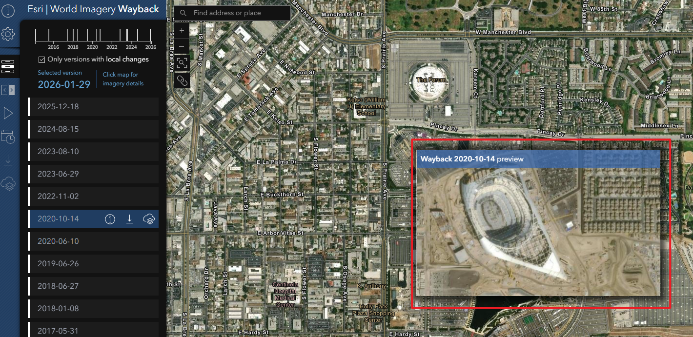
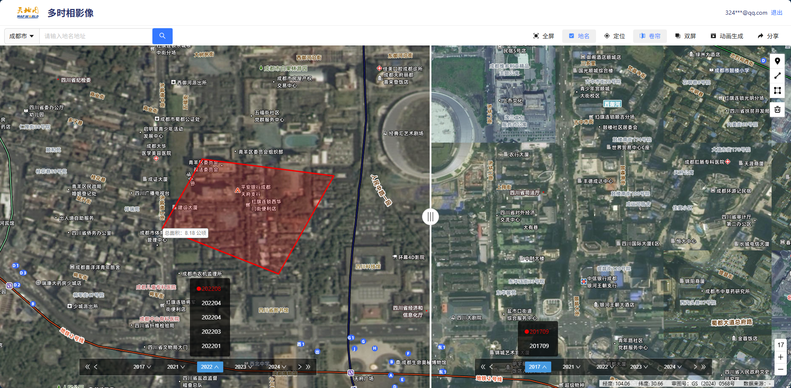
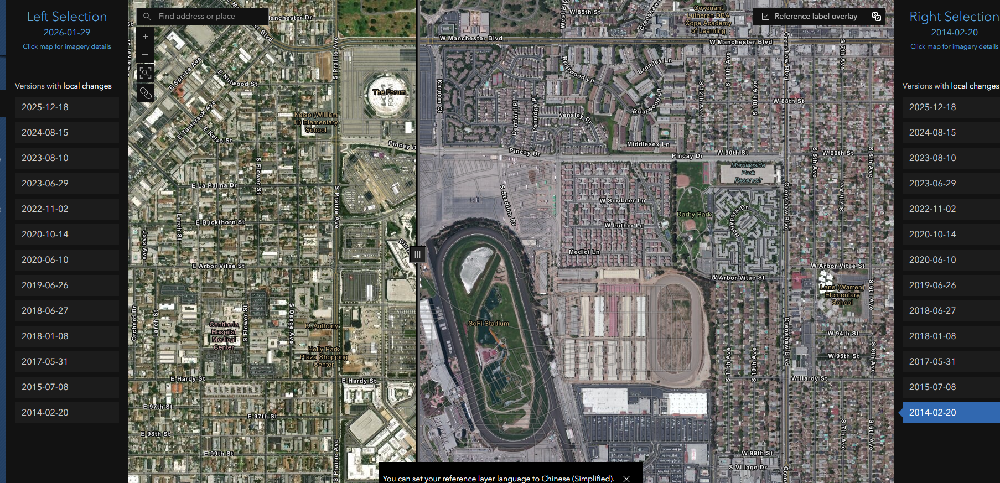
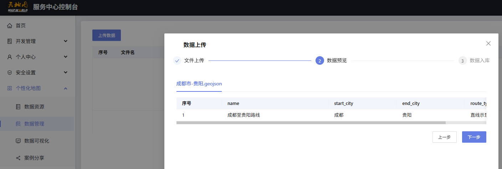
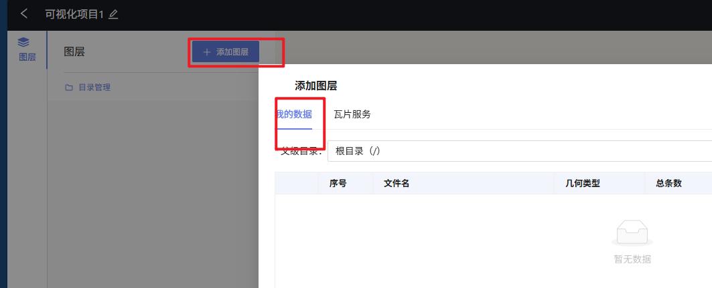
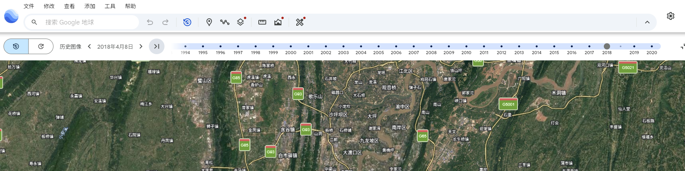

# 样本与范围

- ArcGIS Wayback（多时相影像）：https://livingatlas.arcgis.com/wayback/
- 天地图多日期影像：https://image.tianditu.gov.cn/multidate

# 观察维度

## 小区域快速浏览

- 操作逻辑：
  - 鼠标悬浮在左边列表，地图中心会有一个小窗口展示对应时期的影像。
- 实用价值
  - 可以快速浏览一个区域在不同时间的变化。

- 本项目的预期设计
  - 鼠标悬浮在时间轴上，地图中心会有一个小窗口展示对应时期的影像。

## 卷帘对比

- 操作逻辑：
  - 点击卷帘按钮，会出现两个时间轴，分别选择对应影像/专题。

  

- 操作逻辑：
  - 点击卷帘按钮，会出现两个时间列表，分别选择对应影像/专题。

- 本项目的预期设计
  - 点击卷帘按钮，左右各出现两个图层控件和时间轴，可自由选择图层对比或者同一图层的不同时间。

## 文件上传

- 操作逻辑
  - 能够在详情列表中查看详情，并在详情页中进行编辑，包括属性编辑，要素增删改查等。
- 本项目的预期设计
  - 阶段一：通过图层控件，点击详情，出现属性表，可对属性进行编辑。
  - 阶段二：管图。

## 图层管理

- 操作逻辑
  - 能够在图层列表中查看所有数据，并对其进行管理，包括添加、删除、重命名、调整透明度等。
- 本项目的预期设计
  - 阶段一：通过图层控件，点击详情，出现属性表，可对属性进行编辑。
  - 阶段二：管图。

## 时间轴

# 结论摘要

- 共性：清晰的时间选择与播放控制；图层对比常用卷帘与并排
- 差异：影像源与加载策略不同；对 3D 内容的支持范围不一
- 取舍：优先支持影像卷帘与实体时间播放；3D Tiles 卷帘不纳入 MVP
