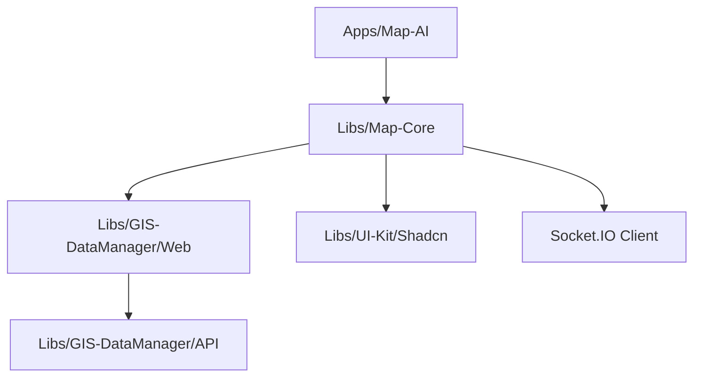
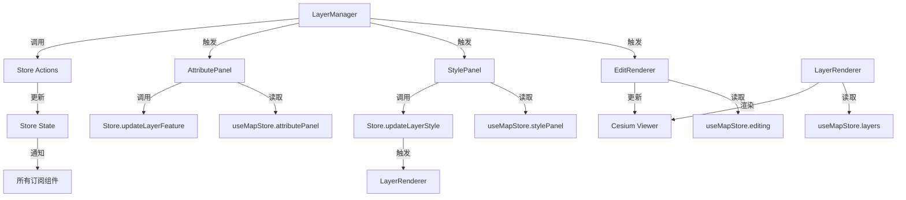

# 架构设计

本文档描述了 GIS 地图核心功能模块（Map Core）的架构设计。本模块不仅提供标准的 WebGIS 功能，还特别针对 **AI 智能体操作** 和 **状态记录** 进行了深度优化，支持通过自然语言指令驱动地图交互。

## 1. 系统架构概览

### 1.1 模块依赖关系



### 1.2 核心设计理念

- **单一数据源 (Single Source of Truth)**: 使用 Zustand Store 管理所有地图状态（图层、相机、交互模式），确保 UI、渲染器和 AI 代理看到的状态一致。
- **指令驱动 (Command Driven)**: AI 对地图的操作被封装为原子化的 "Command"，通过 Socket 下发并执行。
- **状态可序列化 (Serializable State)**: 地图状态必须能被完整序列化为 JSON，以便回传给 AI 上下文。

## 2. 前端组件架构与目录设计

Map Core 采用 **Store-Controller-Renderer** 分层架构，目录结构如下：

```
libs/features/map-core/src/
├── lib/
│   ├── components/            # UI 组件层
│   │   ├── layer-manager.tsx  # 图层管理面板
│   │   ├── add-layer-modal.tsx# 添加图层弹窗
│   │   ├── style-panel.tsx    # 样式配置面板
│   │   ├── attribute-panel.tsx# 属性表面板 (New)
│   │   ├── draw-toolbar.tsx   # 绘图工具栏 (New)
│   │   └── map-viewer.tsx     # 地图入口组件
│   ├── renderer/              # 渲染层 (Headless)
│   │   ├── layer-renderer.tsx # 负责 Cesium 图层增删改查
│   │   ├── draw-renderer.tsx  # 负责绘图交互与渲染 (New)
│   │   └── map-container.tsx  # Cesium Viewer 容器
│   ├── controllers/           # 控制层 (Headless)
│   │   └── map-agent-bridge.tsx # AI 指令监听与状态回传
│   ├── store/                 # 状态层
│   │   └── use-map-store.ts   # Zustand 全局 Store
│   ├── types/                 # 类型定义
│   │   └── map-state.ts       # 地图状态与协议定义
│   └── hooks/                 # 自定义 Hooks
│       └── use-map-socket.ts  # Socket 连接逻辑
└── index.ts                   # 公共导出
```

### 2.1 状态层 (State Layer)

- **文件**: `store/use-map-store.ts`
- **职责**: 全局状态管理器 (Zustand)。
  - **State**:
    - `layers`: 图层列表 (定义见 `map-state.ts`)。
    - `viewport`: 相机状态 (中心点、缩放级别)。
    - `interaction`: 当前交互模式 (选择、绘制、测量)。
    - `selection`: 当前选中的要素信息 (layerId, featureId, properties)。
  - **Actions**: `addLayer`, `removeLayer`, `updateLayerStyle`, `flyTo`, `setSelection`, `setInteractionMode`.

### 2.2 控制层 (Control Layer)

- **文件**: `controllers/map-agent-bridge.tsx`
- **职责**: AI 桥接组件。
  - **监听 Socket**: 接收来自 AI 的 `ui_action` 或 `tool` 事件。
  - **指令分发**: 将 AI 指令转换为 Store 的 Action 调用（如 `toggleLayer` -> `store.toggleLayer`）。
  - **状态同步**: 监听 Store 变化，将最新状态快照 (`MapStateSchema`) 通过 Socket 回传给 AI。

### 2.3 渲染层 (Render Layer)

- **文件**: `renderer/map-container.tsx`, `renderer/layer-renderer.tsx`, `renderer/draw-renderer.tsx`
- **职责**:
  - **`MapContainer`**: Cesium Viewer 的宿主容器，负责 viewer 实例的生命周期。
  - **`LayerRenderer`**: 响应式渲染器。
    - 监听 `useMapStore.layers` 变化。
    - 负责调用 Cesium API (`DataSource`, `Entity`, `Primitive`) 进行实际的增删改查。
    - **Diff 更新**: 对比新旧状态，只更新变化的图层属性，避免全量重绘。
  - **`DrawRenderer`**: 交互渲染器。
    - 监听 `interaction.mode` (DrawPoint, DrawLine, DrawPolygon)。
    - 负责处理鼠标点击事件 (ScreenSpaceEventHandler)。
    - 绘制临时几何体，并在绘制完成后将其转换为 GeoJSON 添加到 "Draw Layer"。

### 2.4 UI 层 (View Layer)

- **文件**: `components/layer-manager.tsx`, `components/add-layer-modal.tsx`, `components/style-panel.tsx`, `components/attribute-panel.tsx`, `components/draw-toolbar.tsx`, `components/time-axis.tsx`
- **职责**:
  - **`LayerManager`**: 左侧悬浮面板，直接绑定 Store，展示图层树。
  - **`AddLayerModal`**: 业务组件，复用 `GIS-DataManager` 的数据源选择能力。
  - **`StylePanel`**: 右侧属性面板，修改当前选中图层的样式。
  - **`AttributePanel`**: 底部抽屉，展示选中要素的属性表，支持编辑属性。
  - **`DrawToolbar`**: 右侧工具栏，切换绘制模式。
  - **`TimeAxis`**: 底部时间轴，展示多时相图层的时间范围。

## 3. 状态管理与 AI 协议

### 3.1 状态定义 (`types/map-state.ts`)

我们复用并扩展现有的状态定义：

```typescript
export type LayerState = {
  id: string;
  name: string;
  type: 'GeoJSON' | 'Tile' | 'Model' | 'Draw'; // 增加 Draw 类型
  visible: boolean;
  opacity: number;
  style: LayerStyle; // 包含 color, width, outline 等
  sourceId?: string; // 关联后端 Dataset ID (Draw 类型可能为空)
  data?: any; // 对于 Draw 图层，直接存储 GeoJSON 数据
};

export type InteractionMode = 'default' | 'draw_point' | 'draw_line' | 'draw_polygon' | 'measure_distance' | 'measure_area';

export type SelectionState = {
  layerId: string | null;
  featureId: string | null;
  properties: Record<string, any> | null;
};

export type MapStateSchema = {
  viewport: {
    center: [number, number]; // [lng, lat]
    zoom: number;
    heading: number;
    pitch: number;
  };
  layers: LayerState[];
  interaction: {
    mode: InteractionMode;
  };
  selection: SelectionState;
};
```

### 3.2 AI 指令集 (Commands)

AI 通过 Socket 发送 `ui_action`，Payload 结构如下：

| Intent (意图)  | Parameters (参数)                    | 说明                     |
| :------------- | :----------------------------------- | :----------------------- |
| `ADD_LAYER`    | `{ datasetId, name }`                | 从后端加载数据并添加图层 |
| `REMOVE_LAYER` | `{ layerId }`                        | 移除指定图层             |
| `TOGGLE_LAYER` | `{ layerId, visible }`               | 控制图层显隐             |
| `FLY_TO`       | `{ center: [lng, lat], zoom }`       | 相机飞行到指定位置       |
| `SET_STYLE`    | `{ layerId, style: {...} }`          | 修改图层样式             |
| `HIGHLIGHT`    | `{ layerId, featureIds }`            | 高亮选中要素             |
| `START_DRAW`   | `{ type: 'point'/'line'/'polygon' }` | 开启绘制模式             |

## 4. 时间轴 (Time Axis)

### 4.1 前端架构设计

- 代码位置：`components/time-axis.tsx`
- 父子组件交互：
  - **父组件**：`LayerRenderer`
    - 监听 `useMapStore.layers` 变化。
    - 筛选出有时间范围的图层。
    - 调用 `setTimeRange` 更新时间轴。
  - **子组件**：`TimeAxis`
    - 接收 `timeRange` 作为 props。
    - 渲染时间轴。
    - 点击立标，回调 `onClick` 函数。
- mock数据

  ```javascript
  const imagedatawithtimeline = [
    {
      id: '1',
      name: '北京市高分二号影像',
      tacquisitionTime: '2023-01-01T00:00:00Z',
      tilePath: 'http://t0.tianditu.gov.cn/img_w/wmts?SERVICE=WMTS&REQUEST=GetTile&VERSION=1.0.0&LAYER=img&STYLE=default&TILEMATRIXSET=w&FORMAT=tiles&TILEMATRIX={z}&TILEROW={y}&TILECOL={x}&tk=db19a177b83bd953b044f0302f2d78b3',
    },
    {
      id: '2',
      name: '北京市高分二号影像',
      tacquisitionTime: '2024-01-02T00:00:00Z',
      tilePath: 'http://t0.tianditu.gov.cn/img_w/wmts?SERVICE=WMTS&REQUEST=GetTile&VERSION=1.0.0&LAYER=img&STYLE=default&TILEMATRIXSET=w&FORMAT=tiles&TILEMATRIX={z}&TILEROW={y}&TILECOL={x}&tk=db19a177b83bd953b044f0302f2d78b3',
    },
  ];
  ```

- 具体实现
  - 状态管理
    - 使用 `useMapStore` 监听 `layers` 变化。
    - 筛选出有时间范围的图层，计算时间范围。
    - 调用 `setTimeRange` 更新时间轴。
  - 事件处理
    - 时间轴上点击立标，调用 `flyTo` 飞行到该时刻。
    - 监听 `useMapStore.viewport` 变化，更新当前时间轴位置。

### 4.2 数据组织方案

1. 数据库模型 (Prisma Schema)
   建议采用 Dataset (数据集) 和 Granule (影像颗粒/时相) 的一对多关系。

```
// 逻辑图层：如“北京市高分二号影像”
model Dataset {
  id          String    @id @default(uuid())
  name        String
  serviceType String    // WMS, WMTS, 或 COG
  baseQuery   String?   // 基础查询路径
  granules    Granule[] // 关联的具体时相数据
  createdAt   DateTime  @default(now())
}

// 物理数据：具体的每一时刻影像
model Granule {
  id          String   @id @default(uuid())
  datasetId   String
  dataset     Dataset  @relation(fields: [datasetId], references: [id])

  acquisitionTime DateTime // 采集时刻（立标的关键）
  tilePath        String   // 瓦片服务路径或文件路径

  // 使用 PostGIS 存储空间范围，方便做空间筛选
  // 注意：Prisma 目前对 PostGIS 原生支持有限，通常配合 $queryRaw 使用
  geom            Unsupported("geometry(Polygon, 4326)")

  @@index([acquisitionTime]) // 必须建索引
}
```

2. 后端接口设计 (NestJS)
   GET /datasets: 获取图层列表。

GET /datasets/:id/timeline: 当用户勾选图层时，调用此接口返回该 Dataset 下所有 Granule 的 acquisitionTime 列表和 id。

GET /granules/:id: 获取特定时相的元数据和 Tile URL。

## 5. 数据流向 (Data Flow)

### 5.1 场景一：用户手动添加图层

1.  用户在 `AddLayerModal` 选择数据。
2.  组件调用 `useMapStore.getState().addLayer(...)`。
3.  Store 更新，`layers` 数组增加一项。
4.  `LayerRenderer` 检测到变化，请求后端 GeoJSON 接口，加载 Cesium DataSource。
5.  `MapAgentBridge` 检测到 Store 变化，通过 Socket 发送新的 `MapStateSchema` 给 AI。
6.  AI 收到消息，"知道" 地图上现在多了一个图层。

### 5.2 场景二：绘制与属性编辑

1.  用户点击 `DrawToolbar` 的 "标点" 按钮。
2.  调用 `store.setInteractionMode('draw_point')`。
3.  `DrawRenderer` 激活，监听鼠标点击。
4.  用户在地图上点击，`DrawRenderer` 捕获坐标，生成一个临时的 GeoJSON Point。
5.  绘制结束，`DrawRenderer` 调用 `store.addLayer` (或更新 Draw 图层)，将新要素加入。
6.  用户点击该点，`LayerRenderer` (或 Event Handler) 捕获点击事件，调用 `store.setSelection(...)`。
7.  `AttributePanel` 监听到 `selection` 变化，自动弹出并显示属性。
8.  用户修改属性，调用 `store.updateLayerFeature(...)` (需新增 Action)。
9.  Store 更新，渲染器更新。

## 6. 后端 API 扩展

### 6.1 获取 GeoJSON 数据

- **URL**: `GET /api/datasets/:id/geojson`
- **职责**: 将 PostGIS 中的 `GisFeature` 转换为标准的 GeoJSON FeatureCollection 返回给前端。
- **优化**: 对于大数据量，后续可扩展为 MVT 矢量瓦片服务 (`/api/datasets/:id/tiles/{z}/{x}/{y}.pbf`)。

---

## 7. 图层操作菜单功能技术设计

### 7.1 开启编辑 / 停止编辑

#### 7.1.1 状态设计

在 `use-map-store.ts` 中扩展编辑状态：

```typescript
// 编辑模式类型
export type EditingMode = 'drag' | 'vertex' | 'draw';

// 编辑状态
export type EditingState = {
  activeLayerId: string | null;      // 当前编辑的图层 ID
  editedFeatureId: string | null;    // 当前编辑的要素 ID
  editingMode: EditingMode;          // 编辑模式
  unsavedChanges: boolean;           // 是否有未保存的更改
  hoveredFeatureId: string | null;   // 悬停的要素 ID
 吸附 PreviewPosition: [number, number] | null; // 吸附预览位置
};

// 在 MapStateSchema 中添加 editing 字段
export type MapStateSchema = {
  // ... 现有字段
  editing: EditingState;
};
```

在 Store 中新增 Actions：

```typescript
interface MapStoreActions {
  // ... 现有 Actions

  // 编辑相关 Actions
  startEditing: (layerId: string) => void;
  stopEditing: (saveChanges: boolean) => void;
  setEditingMode: (mode: EditingMode) => void;
  setEditedFeature: (featureId: string | null) => void;
  updateFeatureGeometry: (layerId: string, featureId: string, geometry: unknown) => void;
}
```

#### 7.1.2 组件设计

**LayerManager 组件扩展**：
- 在图层列表中，当前编辑图层使用蓝色高亮边框和铅笔图标标识。
- 菜单中"开启编辑"/"停止编辑"切换状态。

**EditRenderer 组件（新增）**：
- 位置：`renderer/edit-renderer.tsx`
- 职责：
  - 监听 `editing.activeLayerId` 和 `editing.editedFeatureId`。
  - 当图层处于编辑模式时，将该图层渲染至最顶层（zIndex 最高）。
  - 渲染要素的高亮效果（边框、放大等）。
  - 处理编辑交互事件（拖拽、顶点编辑、吸附）。

```typescript
// EditRenderer 伪代码
export function EditRenderer() {
  const { activeLayerId, editedFeatureId, editingMode } = useMapStore(state => state.editing);
  const layers = useMapStore(state => state.layers);
  const viewer = useCesiumViewer();

  useEffect(() => {
    if (!activeLayerId) return;

    const layer = layers.find(l => l.id === activeLayerId);
    if (!layer) return;

    // 将编辑图层置顶
    viewer.entities.raiseToTop(layer.dataSource);

    // 高亮显示所有要素
    highlightLayer(layer.id);

  }, [activeLayerId, viewer]);

  useEffect(() => {
    if (editingMode === 'drag') {
      setupDragInteraction();
    } else if (editingMode === 'vertex') {
      setupVertexEditing();
    }
  }, [editingMode]);

  // 吸附效果
  const handleMouseMove = (position: Cartographic) => {
    const snappedPosition = snapToLine(position, layer.data);
    if (snappedPosition) {
      showPreviewPoint(snappedPosition);
    }
  };
}
```

#### 7.1.3 交互实现细节

**点图层拖拽**：
```typescript
function setupPointDrag(featureId: string) {
  const handler = new ScreenSpaceEventHandler();

  handler.setInputAction((movement) => {
    const pickedFeature = viewer.scene.pick(movement.position);
    if (pickedFeature?.id === featureId) {
      setCursor('grab');
    }
  }, ScreenSpaceEventType.MOUSE_MOVE);

  handler.setInputAction((movement) => {
    if (pickedFeature) {
      setCursor('grabbing');
      // 更新要素位置
      updateFeatureGeometry(featureId, movement.position);
    }
  }, ScreenSpaceEventType.LEFT_DRAG);
}
```

**线/面节点编辑**：
```typescript
interface VertexHandle {
  id: string;
  position: Cartographic;
  featureId: string;
  index: number; // 节点在线/面中的索引
}

function renderVertexHandles(feature: Feature): VertexHandle[] {
  // 为每个节点渲染一个可点击的 handle
  return feature.geometry.coordinates.map((coord, index) => ({
    id: `vertex-${feature.id}-${index}`,
    position: coord,
    featureId: feature.id,
    index,
  }));
}

function handleSegmentClick(segment: [VertexHandle, VertexHandle]) {
  // 在两个节点中间插入新节点
  const newPosition = midpoint(segment[0].position, segment[1].position);
  insertVertex(segment[0].featureId, segment[0].index + 1, newPosition);
}
```

**吸附逻辑**：
```typescript
function snapToLine(position: Cartographic, lineData: LineString, threshold: number = 10): Cartographic | null {
  const mouseRay = viewer.camera.getPickRay(position);
  let closestDistance = Infinity;
  let snappedPosition: Cartographic | null = null;

  for (const segment of lineData.coordinates) {
    const projection = projectPointToSegment(mouseRay, segment);
    const screenDistance = distanceToScreen(mouseRay, projection);

    if (screenDistance < threshold && screenDistance < closestDistance) {
      closestDistance = screenDistance;
      snappedPosition = projection;
    }
  }

  return snappedPosition;
}
```

#### 7.1.4 数据流

```
用户点击"开启编辑"
  -> LayerManager.setActiveLayer(layerId)
  -> Store.editing.activeLayerId = layerId
  -> EditRenderer 激活
  -> 图层置顶渲染，要素高亮
  -> 鼠标交互事件监听激活

用户拖动点要素
  -> EditRenderer 捕获 LEFT_DRAG 事件
  -> updateFeatureGeometry(layerId, featureId, newGeometry)
  -> Store 更新
  -> LayerRenderer 重新渲染
  -> 支持 Ctrl+Z 撤销

用户点击"停止编辑"
  -> LayerManager.setActiveLayer(null)
  -> Store.editing.activeLayerId = null
  -> EditRenderer 清理交互监听
  -> 如有未保存更改，弹出确认对话框
```

---

### 7.2 缩放至图层

#### 7.2.1 工具函数

```typescript
// utils/camera-utils.ts

import { Cartographic, Rectangle, Camera } from 'cesium';

/**
 * 计算图层的边界范围
 */
export function computeLayerBounds(features: Feature[]): Rectangle {
  let minX = Infinity, minY = Infinity, maxX = -Infinity, maxY = -Infinity;

  for (const feature of features) {
    const coords = flattenCoordinates(feature.geometry.coordinates);
    for (const [lng, lat] of coords) {
      minX = Math.min(minX, lng);
      minY = Math.min(minY, lat);
      maxX = Math.max(maxX, lng);
      maxY = Math.max(maxY, lat);
    }
  }

  return Rectangle.fromDegrees(minX, minY, maxX, maxY);
}

/**
 * 相机飞行到目标范围
 */
export function flyToBounds(viewer: Viewer, bounds: Rectangle, options?: {
  duration?: number;
  offset?: number;
}): void {
  const { duration = 2, offset = 1.5 } = options || {};

  // 计算合适的相机高度
  const diagonal = Rectangle.computeRectangle(bounds).width;
  const destinationHeight = diagonal * offset;

  viewer.camera.flyTo({
    destination: Rectangle.center(bounds),
    orientation: {
      heading: 0,
      pitch: -Math.PI / 2,
      roll: 0,
    },
    duration,
  });
}

/**
 * 处理特殊情况：单个点要素
 */
export function flyToPoint(viewer: Viewer, point: [number, number], zoom: number = 15): void {
  const destination = Cartographic.fromDegrees(point[0], point[1], 1000);

  viewer.camera.flyTo({
    destination,
    orientation: {
      heading: 0,
      pitch: -Math.PI / 2,
    },
    duration: 2,
  });
}
```

#### 7.2.2 Store Action

```typescript
// store/use-map-store.ts
setViewport: (viewport: Partial<ViewportState>) =>
  set((state) => {
    state.viewport = { ...state.viewport, ...viewport };
  }),

// 新增：缩放至图层
flyToLayer: (layerId: string) => {
  const layer = get().layers.find(l => l.id === layerId);
  if (!layer || !layer.data) return;

  const bounds = computeLayerBounds(layer.data.features);
  // 通过事件或回调通知渲染器执行飞行
  get().viewportTarget = bounds;
}
```

---

### 7.3 属性表

#### 7.3.1 状态设计

```typescript
// types/map-state.ts 扩展
export type AttributePanelState = {
  isOpen: boolean;
  layerId: string | null;
  selectedFeatureIds: string[];
  sortColumn: string | null;
  sortOrder: 'asc' | 'desc' | null;
  searchQuery: string;
  visibleColumns: string[]; // 字段选择器
  pagination: {
    page: number;
    pageSize: number;
    total: number;
  };
};

// 在 Store 中添加
interface MapStoreActions {
  // ... 现有 Actions

  // 属性表面板 Actions
  openAttributePanel: (layerId: string) => void;
  closeAttributePanel: () => void;
  selectFeatures: (featureIds: string[]) => void;
  deleteFeatures: (featureIds: string[]) => void;
  setAttributeSort: (column: string, order: 'asc' | 'desc' | null) => void;
  setSearchQuery: (query: string) => void;
  setVisibleColumns: (columns: string[]) => void;
}
```

#### 7.3.2 组件设计

**AttributePanel 组件（新增）**：
- 位置：`components/attribute-panel.tsx`
- 依赖：`@txwx-monorepo/ui-kit` 的 `Table`, `Dialog`, `Button`, `Input` 等组件

```typescript
import { Table, TableHeader, TableBody, TableRow, TableHead, TableCell } from '@txwx-monorepo/ui-kit';
import { Button } from '@txwx-monorepo/ui-kit';
import { Input } from '@txwx-monorepo/ui-kit';
import { X, Download, Trash2, Crosshair, Search, ArrowUpDown } from 'lucide-react';

export function AttributePanel() {
  const {
    isOpen,
    layerId,
    selectedFeatureIds,
    sortColumn,
    sortOrder,
    searchQuery,
    visibleColumns
  } = useMapStore(state => state.attributePanel);

  const closeAttributePanel = useMapStore(state => state.closeAttributePanel);
  const deleteFeatures = useMapStore(state => state.deleteFeatures);
  const openAttributePanel = useMapStore(state => state.openAttributePanel);

  const layer = useMapStore(state => state.layers.find(l => l.id === layerId));
  const features = layer?.data?.features || [];

  // 获取所有字段名
  const allColumns = React.useMemo(() => {
    const columns = new Set<string>();
    features.forEach(f => {
      Object.keys(f.properties || {}).forEach(key => columns.add(key));
    });
    return Array.from(columns);
  }, [features]);

  // 筛选和排序
  const filteredFeatures = React.useMemo(() => {
    let result = features;

    // 搜索筛选
    if (searchQuery) {
      result = result.filter(f =>
        Object.values(f.properties || {}).some(v =>
          String(v).toLowerCase().includes(searchQuery.toLowerCase())
        )
      );
    }

    // 排序
    if (sortColumn && sortOrder) {
      result = [...result].sort((a, b) => {
        const aVal = a.properties?.[sortColumn];
        const bVal = b.properties?.[sortColumn];

        if (aVal < bVal) return sortOrder === 'asc' ? -1 : 1;
        if (aVal > bVal) return sortOrder === 'asc' ? 1 : -1;
        return 0;
      });
    }

    return result;
  }, [features, searchQuery, sortColumn, sortOrder]);

  return (
    <Drawer open={isOpen} onClose={closeAttributePanel} className="h-96">
      <div className="flex flex-col h-full">
        {/* 标题栏 */}
        <div className="flex items-center justify-between p-4 border-b">
          <div className="flex items-center gap-2">
            <h3 className="font-medium">{layer?.name}</h3>
            <span className="text-sm text-gray-500">({features.length} 个要素)</span>
          </div>
          <div className="flex items-center gap-2">
            <Button variant="outline" size="sm" title="导出">
              <Download className="w-4 h-4" />
            </Button>
            <Button variant="ghost" size="sm" onClick={closeAttributePanel}>
              <X className="w-4 h-4" />
            </Button>
          </div>
        </div>

        {/* 工具栏 */}
        <div className="flex items-center justify-between p-2 border-b bg-gray-50">
          <div className="flex items-center gap-2">
            <Checkbox
              checked={selectedFeatureIds.length === features.length}
              onChange={(checked) => {
                if (checked) {
                  selectFeatures(features.map(f => f.id));
                } else {
                  selectFeatures([]);
                }
              }}
            />
            <Button
              variant="outline"
              size="sm"
              disabled={selectedFeatureIds.length === 0}
              onClick={() => {
                if (confirm(`确定删除选中的 ${selectedFeatureIds.length} 个要素？`)) {
                  deleteFeatures(selectedFeatureIds);
                }
              }}
            >
              <Trash2 className="w-3 h-3 mr-1" />
              删除选中
            </Button>
          </div>
          <div className="flex items-center gap-2">
            <div className="relative">
              <Search className="w-3 h-3 absolute left-2 top-1/2 -translate-y-1/2 text-gray-400" />
              <Input
                placeholder="搜索..."
                value={searchQuery}
                onChange={(e) => setSearchQuery(e.target.value)}
                className="pl-8 w-48"
              />
            </div>
          </div>
        </div>

        {/* 表格区域 */}
        <div className="flex-1 overflow-auto">
          <Table>
            <TableHeader>
              <TableRow>
                <TableHead className="w-12"></TableHead>
                <TableHead className="w-12">#</TableHead>
                {(visibleColumns.length > 0 ? visibleColumns : allColumns).map(column => (
                  <TableHead key={column}>
                    <div className="flex items-center gap-1 cursor-pointer hover:bg-gray-100"
                         onClick={() => {
                           if (sortColumn === column) {
                             setAttributeSort(column, sortOrder === 'asc' ? 'desc' : null);
                           } else {
                             setAttributeSort(column, 'asc');
                           }
                         }}
                    >
                      {column}
                      {sortColumn === column && (
                        <ArrowUpDown className={`w-3 h-3 ${sortOrder === 'desc' ? 'rotate-180' : ''}`} />
                      )}
                    </div>
                  </TableHead>
                ))}
                <TableHead className="w-20">操作</TableHead>
              </TableRow>
            </TableHeader>
            <TableBody>
              {filteredFeatures.map((feature, index) => (
                <TableRow key={feature.id} className={selectedFeatureIds.includes(feature.id) ? 'bg-blue-50' : ''}>
                  <TableCell>
                    <Checkbox
                      checked={selectedFeatureIds.includes(feature.id)}
                      onChange={(checked) => {
                        if (checked) {
                          selectFeatures([...selectedFeatureIds, feature.id]);
                        } else {
                          selectFeatures(selectedFeatureIds.filter(id => id !== feature.id));
                        }
                      }}
                    />
                  </TableCell>
                  <TableCell className="text-gray-500">{index + 1}</TableCell>
                  {(visibleColumns.length > 0 ? visibleColumns : allColumns).map(column => (
                    <TableCell key={column}>
                      {String(feature.properties?.[column] ?? '-')}
                    </TableCell>
                  ))}
                  <TableCell>
                    <div className="flex items-center gap-1">
                      <Button
                        variant="ghost"
                        size="sm"
                        title="定位到要素"
                        onClick={() => flyToFeature(feature)}
                      >
                        <Crosshair className="w-3 h-3" />
                      </Button>
                    </div>
                  </TableCell>
                </TableRow>
              ))}
            </TableBody>
          </Table>
        </div>
      </div>
    </Drawer>
  );
}
```

#### 7.3.3 数据流

```
用户点击"属性表"
  -> LayerManager 调用 openAttributePanel(layerId)
  -> Store.attributePanel.isOpen = true
  -> Store.attributePanel.layerId = layerId
  -> AttributePanel 组件渲染
  -> 从 layer.data.features 获取属性数据
  -> 渲染表格

用户编辑单元格
  -> 点击单元格进入编辑模式
  -> 调用 updateLayerFeature(layerId, featureId, { [field]: newValue })
  -> Store 更新
  -> 表格重新渲染

用户点击"定位到要素"
  -> flyToFeature(feature)
  -> 计算要素边界
  -> viewer.camera.flyTo(...)
  -> 要素高亮闪烁

用户点击"删除选中"
  -> 二次确认
  -> deleteFeatures(selectedFeatureIds)
  -> layer.data.features = features.filter(f => !selectedFeatureIds.includes(f.id))
  -> 通知渲染器更新
```

---

### 7.4 样式设置

#### 7.4.1 状态设计

```typescript
// types/map-state.ts 扩展
export type LayerStylePanelState = {
  isOpen: boolean;
  layerId: string | null;
  activeTab: 'preset' | 'custom';
  unsavedChanges: boolean;
};

// Store Actions
interface MapStoreActions {
  // ... 现有 Actions

  // 样式面板 Actions
  openStylePanel: (layerId: string) => void;
  closeStylePanel: () => void;
  updateLayerStyle: (layerId: string, style: Partial<LayerStyle>) => void;
  applyPresetStyle: (layerId: string, presetId: string) => void;
  resetLayerStyle: (layerId: string) => void;
}
```

#### 7.4.2 预设样式定义

```typescript
// constants/style-presets.ts
export interface StylePreset {
  id: string;
  name: string;
  geometryType: 'Point' | 'LineString' | 'Polygon';
  style: LayerStyle;
  thumbnail?: string; // 可选的预览图
}

export const pointPresets: StylePreset[] = [
  {
    id: 'point-default',
    name: '默认',
    geometryType: 'Point',
    style: {
      color: '#3b82f6',
      pointSize: 8,
      opacity: 1,
      outlineColor: '#ffffff',
      outlineWidth: 1,
    },
  },
  {
    id: 'point-red',
    name: '红色标记',
    geometryType: 'Point',
    style: {
      color: '#ef4444',
      pointSize: 10,
      opacity: 1,
      outlineColor: '#ffffff',
      outlineWidth: 2,
    },
  },
  // ... 更多预设
];

export const linePresets: StylePreset[] = [
  {
    id: 'line-default',
    name: '默认',
    geometryType: 'LineString',
    style: {
      color: '#3b82f6',
      width: 2,
      opacity: 1,
    },
  },
  {
    id: 'line-bold',
    name: '红色粗线',
    geometryType: 'LineString',
    style: {
      color: '#ef4444',
      width: 4,
      opacity: 1,
    },
  },
  {
    id: 'line-dashed',
    name: '虚线',
    geometryType: 'LineString',
    style: {
      color: '#6b7280',
      width: 2,
      opacity: 1,
      dashPattern: [5, 5],
    },
  },
  // ... 更多预设
];

export const polygonPresets: StylePreset[] = [
  {
    id: 'polygon-default',
    name: '默认',
    geometryType: 'Polygon',
    style: {
      color: '#3b82f6',
      opacity: 0.3,
      outlineColor: '#3b82f6',
      outlineWidth: 1,
    },
  },
  // ... 更多预设
];
```

#### 7.4.3 组件设计

**StylePanel 组件**：
- 位置：`components/style-panel.tsx`
- 使用 Drawer 从右侧滑出

```typescript
import { Drawer, Tabs, TabsContent, Label, Slider, ColorPicker } from '@txwx-monorepo/ui-kit';
import { X, RotateCcw, Palette } from 'lucide-react';

export function StylePanel() {
  const { isOpen, layerId, activeTab } = useMapStore(state => state.stylePanel);
  const closeStylePanel = useMapStore(state => state.closeStylePanel);
  const updateLayerStyle = useMapStore(state => state.updateLayerStyle);
  const resetLayerStyle = useMapStore(state => state.resetLayerStyle);

  const layer = useMapStore(state => state.layers.find(l => l.id === layerId));
  const style = layer?.style || {};

  const handleStyleChange = (key: string, value: unknown) => {
    updateLayerStyle(layerId!, { [key]: value });
  };

  const handlePresetClick = (preset: StylePreset) => {
    updateLayerStyle(layerId!, preset.style);
  };

  const handleReset = () => {
    if (confirm('确定重置样式为默认值？')) {
      resetLayerStyle(layerId!);
    }
  };

  return (
    <Drawer
      open={isOpen}
      onClose={closeStylePanel}
      side="right"
      className="w-80"
    >
      <div className="flex flex-col h-full">
        {/* 标题栏 */}
        <div className="flex items-center justify-between p-4 border-b">
          <div className="flex items-center gap-2">
            <Palette className="w-4 h-4 text-gray-500" />
            <h3 className="font-medium">{layer?.name}</h3>
            <span className="text-xs text-gray-400">
              {layer?.type === 'GeoJSON' ? '矢量图层' : layer?.type}
            </span>
          </div>
          <div className="flex items-center gap-1">
            <Button variant="ghost" size="sm" onClick={handleReset} title="重置样式">
              <RotateCcw className="w-3 h-3" />
            </Button>
            <Button variant="ghost" size="sm" onClick={closeStylePanel}>
              <X className="w-4 h-4" />
            </Button>
          </div>
        </div>

        {/* 内容区域 */}
        <div className="flex-1 overflow-auto p-4">
          <Tabs value={activeTab} onValueChange={(v) => setActiveTab(v as 'preset' | 'custom')}>
            <TabsContent value="preset">
              <div className="grid grid-cols-2 gap-2">
                {getPresetsByGeometryType(layer?.type).map(preset => (
                  <button
                    key={preset.id}
                    className={`p-3 rounded border hover:shadow-sm transition-all ${
                      // 检查当前样式是否匹配预设
                      isStyleMatch(style, preset.style)
                        ? 'border-blue-500 bg-blue-50'
                        : 'border-gray-200 bg-white'
                    }`}
                    onClick={() => handlePresetClick(preset)}
                  >
                    <div className="text-sm font-medium mb-1">{preset.name}</div>
                    {/* 样式预览 */}
                    <StylePreview style={preset.style} geometryType={preset.geometryType} />
                  </button>
                ))}
              </div>
            </TabsContent>

            <TabsContent value="custom">
              <div className="space-y-4">
                {/* 通用设置 */}
                <section>
                  <h4 className="text-sm font-medium mb-2 text-gray-600">通用</h4>
                  <div className="space-y-3">
                    <div>
                      <Label>不透明度</Label>
                      <Slider
                        value={[style.opacity ?? 1]}
                        min={0}
                        max={1}
                        step={0.01}
                        onValueChange={([v]) => handleStyleChange('opacity', v)}
                      />
                      <span className="text-xs text-gray-500">{Math.round((style.opacity ?? 1) * 100)}%</span>
                    </div>

                    <div>
                      <Label>最小缩放级别</Label>
                      <Input
                        type="number"
                        value={style.minZoom ?? 0}
                        onChange={(e) => handleStyleChange('minZoom', Number(e.target.value))}
                      />
                    </div>

                    <div>
                      <Label>最大缩放级别</Label>
                      <Input
                        type="number"
                        value={style.maxZoom ?? 22}
                        onChange={(e) => handleStyleChange('maxZoom', Number(e.target.value))}
                      />
                    </div>
                  </div>
                </section>

                {/* 点图层专属 */}
                {layer?.type === 'Point' && (
                  <section>
                    <h4 className="text-sm font-medium mb-2 text-gray-600">点样式</h4>
                    <div className="space-y-3">
                      <div>
                        <Label>颜色</Label>
                        <ColorPicker
                          value={style.color ?? '#3b82f6'}
                          onChange={(color) => handleStyleChange('color', color)}
                        />
                      </div>

                      <div>
                        <Label>大小（半径）</Label>
                        <Slider
                          value={[style.pointSize ?? 8]}
                          min={2}
                          max={50}
                          step={1}
                          onValueChange={([v]) => handleStyleChange('pointSize', v)}
                        />
                        <span className="text-xs text-gray-500">{style.pointSize ?? 8}px</span>
                      </div>

                      <div>
                        <Label>边框颜色</Label>
                        <ColorPicker
                          value={style.outlineColor ?? '#ffffff'}
                          onChange={(color) => handleStyleChange('outlineColor', color)}
                        />
                      </div>

                      <div>
                        <Label>边框宽度</Label>
                        <Slider
                          value={[style.outlineWidth ?? 1]}
                          min={0}
                          max={5}
                          step={0.5}
                          onValueChange={([v]) => handleStyleChange('outlineWidth', v)}
                        />
                      </div>
                    </div>
                  </section>
                )}

                {/* 线图层专属 */}
                {layer?.type === 'LineString' && (
                  <section>
                    <h4 className="text-sm font-medium mb-2 text-gray-600">线样式</h4>
                    <div className="space-y-3">
                      <div>
                        <Label>颜色</Label>
                        <ColorPicker
                          value={style.color ?? '#3b82f6'}
                          onChange={(color) => handleStyleChange('color', color)}
                        />
                      </div>

                      <div>
                        <Label>宽度</Label>
                        <Slider
                          value={[style.width ?? 2]}
                          min={1}
                          max={20}
                          step={0.5}
                          onValueChange={([v]) => handleStyleChange('width', v)}
                        />
                        <span className="text-xs text-gray-500">{style.width ?? 2}px</span>
                      </div>

                      <div>
                        <Label>线型</Label>
                        <Select
                          value={style.lineType ?? 'solid'}
                          onValueChange={(v) => handleStyleChange('lineType', v)}
                        >
                          <option value="solid">实线</option>
                          <option value="dashed">虚线</option>
                          <option value="dotted">点线</option>
                        </Select>
                      </div>
                    </div>
                  </section>
                )}

                {/* 面图层专属 */}
                {layer?.type === 'Polygon' && (
                  <section>
                    <h4 className="text-sm font-medium mb-2 text-gray-600">面样式</h4>
                    <div className="space-y-3">
                      <div>
                        <Label>填充颜色</Label>
                        <ColorPicker
                          value={style.color ?? '#3b82f6'}
                          onChange={(color) => handleStyleChange('color', color)}
                        />
                      </div>

                      <div>
                        <Label>填充不透明度</Label>
                        <Slider
                          value={[style.opacity ?? 0.3]}
                          min={0}
                          max={1}
                          step={0.01}
                          onValueChange={([v]) => handleStyleChange('opacity', v)}
                        />
                      </div>

                      <div>
                        <Label>边框颜色</Label>
                        <ColorPicker
                          value={style.outlineColor ?? '#3b82f6'}
                          onChange={(color) => handleStyleChange('outlineColor', color)}
                        />
                      </div>

                      <div>
                        <Label>边框宽度</Label>
                        <Slider
                          value={[style.outlineWidth ?? 1]}
                          min={0}
                          max={10}
                          step={0.5}
                          onValueChange={([v]) => handleStyleChange('outlineWidth', v)}
                        />
                      </div>
                    </div>
                  </section>
                )}
              </div>
            </TabsContent>
          </Tabs>
        </div>
      </div>
    </Drawer>
  );
}
```

#### 7.4.4 实时预览实现

```typescript
// renderer/style-renderer.tsx

// 当样式更新时，实时更新 Cesium 图层
useEffect(() => {
  if (!layer?.dataSource) return;

  const entities = layer.dataSource.entities;

  entities.values.forEach(entity => {
    if (layer.type === 'Point') {
      entity.point = {
        ...entity.point,
        color: Color.fromCssColorString(style.color ?? '#3b82f6'),
        pixelSize: style.pointSize ?? 8,
        outlineColor: Color.fromCssColorString(style.outlineColor ?? '#ffffff'),
        outlineWidth: style.outlineWidth ?? 1,
      };
    } else if (layer.type === 'LineString') {
      entity.polyline = {
        ...entity.polyline,
        material: new PolylineDashMaterialProperty({
          color: Color.fromCssColorString(style.color ?? '#3b82f6'),
          lineWidth: style.width ?? 2,
          dashPattern: style.lineType === 'dashed' ? [5, 5] : undefined,
        }),
      };
    } else if (layer.type === 'Polygon') {
      entity.polygon = {
        ...entity.polygon,
        material: Color.fromCssColorString(style.color ?? '#3b82f6').withAlpha(style.opacity ?? 0.3),
        outline: true,
        outlineColor: Color.fromCssColorString(style.outlineColor ?? '#3b82f6'),
        outlineWidth: style.outlineWidth ?? 1,
      };
    }
  });
}, [layer?.style]);
```

#### 7.4.5 数据流

```
用户点击"样式设置"
  -> LayerManager 调用 openStylePanel(layerId)
  -> Store.stylePanel.isOpen = true
  -> Store.stylePanel.layerId = layerId
  -> StylePanel 组件从右侧滑出
  -> 加载当前图层样式

用户选择预设
  -> handlePresetClick(preset)
  -> updateLayerStyle(layerId, preset.style)
  -> Store 更新
  -> LayerRenderer 检测到样式变化
  -> 更新 Cesium Entity/Primitive 样式
  -> 地图实时预览

用户自定义样式
  -> 修改滑块/颜色选择器
  -> handleStyleChange(key, value)
  -> updateLayerStyle(layerId, { [key]: value })
  -> 同上实时更新

用户点击"重置样式"
  -> 二次确认
  -> resetLayerStyle(layerId)
  -> 恢复默认样式

用户关闭面板
  -> closeStylePanel()
  -> Drawer 滑出隐藏
```

---

## 8. 组件依赖关系图



---

## 9. 接口设计

### 9.1 Store Actions 完整列表

| Action | 参数 | 返回值 | 说明 |
|--------|------|--------|------|
| `startEditing` | `layerId: string` | `void` | 开启图层编辑模式 |
| `stopEditing` | `saveChanges: boolean` | `void` | 停止编辑，可选是否保存 |
| `openAttributePanel` | `layerId: string` | `void` | 打开属性表面板 |
| `closeAttributePanel` | - | `void` | 关闭属性表面板 |
| `openStylePanel` | `layerId: string` | `void` | 打开样式设置面板 |
| `closeStylePanel` | - | `void` | 关闭样式设置面板 |
| `updateLayerStyle` | `layerId: string, style: Partial<LayerStyle>` | `void` | 更新图层样式 |
| `resetLayerStyle` | `layerId: string` | `void` | 重置图层样式为默认 |
| `deleteFeatures` | `featureIds: string[]` | `void` | 删除选中要素 |
| `flyToLayer` | `layerId: string` | `void` | 缩放至图层 |
| `updateFeatureGeometry` | `layerId: string, featureId: string, geometry: unknown` | `void` | 更新要素几何 |

### 9.2 外部 API 接口

| 方法 | URL | 说明 |
|------|-----|------|
| `GET` | `/api/datasets/:id/geojson` | 获取数据集 GeoJSON |
| `GET` | `/api/datasets/:id/timeline` | 获取时间轴数据 |
| `POST` | `/api/datasets/:id/features` | 新增/更新要素 |
| `DELETE` | `/api/datasets/:id/features/:featureId` | 删除要素 |
